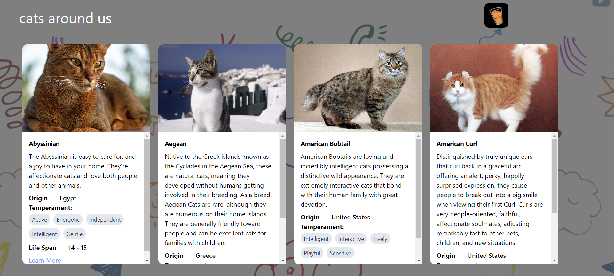
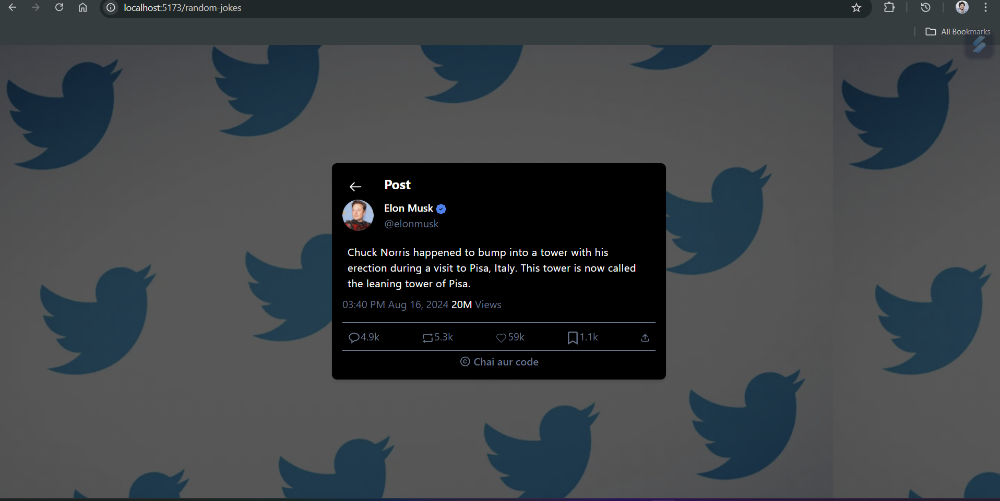

# React + Vite

#### Task 3 Cats Listing completed 

##### description: 

## Task 2 Jokes Tweet completed

#### Cats Listing Component
The `CatsListing` component fetches and displays a list of cats with details like their name, origin, temperament, and more. The data is retrieved from an external API and rendered using a custom CatsCard component.

##### Key Features:
* API Integration: Uses Axios to fetch cat data from an API and displays it dynamically.

* Custom Cards: Each cat's information is displayed in a card format using the CatsCard component.

* Logo Display: A chaiLogo is displayed in the header as part of the branding.
Responsive Layout: The layout is styled with Tailwind CSS, ensuring responsiveness and a visually appealing design.

#### Random Jokes Tweet Component
This React component, `RandomJokesTweet`, displays a random joke styled like a tweet from Elon Musk. The design mimics the appearance of a social media post, complete with user details, the joke content, engagement icons, and a timestamp.

##### Features:
* Fetching Data: The component uses Axios to fetch a random joke from an external API when the component mounts.

* Icons and Styling: It uses several icons from libraries like react-icons to replicate typical social media interactions such as comments, retweets, likes, bookmarks, and shares.

* Date and Time Formatting: The current date and time are formatted using date-fns and displayed alongside the joke content.

* Responsive Design: The component is styled with Tailwind CSS, ensuring it is visually appealing and responsive on different screen sizes.

* Profile and Verification Badge: Displays a mock profile picture and a verification badge using the BsPatchCheckFill icon.
##### Dependencies:
* `axios` for making HTTP requests.
* `date-fns` for formatting dates and times.
* `react-icons` for a variety of icons used in the UI.

#### Task 1 not fully completed work in progress

All The Features parts are done only design part is Reamaining lots of improvement